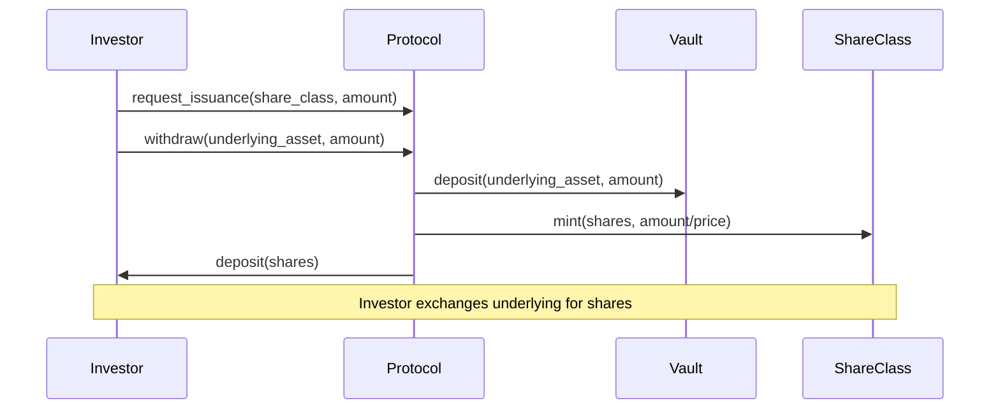
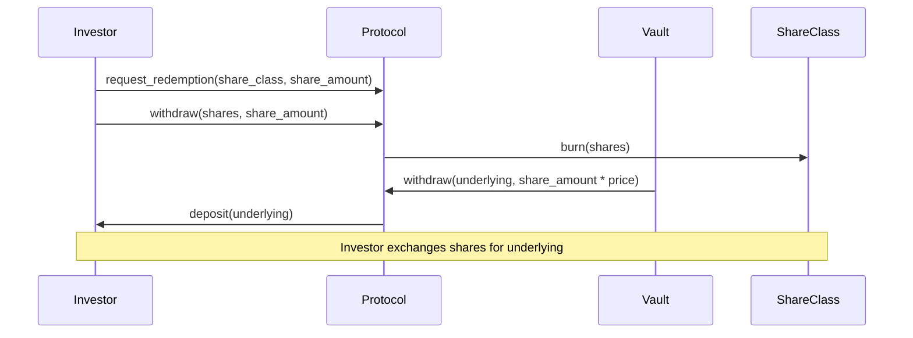

# Mock CLO Exchange

A Move-based Mock Collateralized Loan Obligation (CLO) exchange protocol built on Aptos blockchain. This protocol allows users to exchange underlying assets (like USDC) for share class tokens representing fractional ownership in a managed fund.

## Overview

The Mock CLO Exchange implements a simplified version of a CLO structure where:
- **Underlying Assets**: External fungible assets like USDC that investors deposit
- **Share Classes**: Protocol-issued tokens representing proportional ownership
- **Exchange Mechanism**: Fixed-price conversion between underlying assets and shares
- **Vault Management**: Protocol-controlled treasury holding underlying assets

## Architecture

### Core Components

```
┌─────────────────────────────────────────────────────────────┐
│                    Mock CLO Exchange                        │
├─────────────────────────────────────────────────────────────┤
│                                                             │
│  ┌─────────────────┐    ┌─────────────────┐                │
│  │ ProtocolConfig  │    │ ShareClassData  │                │
│  │ - admin: addr   │    │ - underlying    │                │
│  │ - vault_cap     │    │ - price_per_share│               │
│  └─────────────────┘    │ - mint_cap      │                │
│                         │ - burn_cap      │                │
│                         │ - transfer_cap  │                │
│                         └─────────────────┘                │
│                                                             │
└─────────────────────────────────────────────────────────────┘
```

### Data Structures

#### 1. ProtocolConfig
- **Purpose**: Global protocol configuration
- **Location**: Stored at `@mock_clo` address
- **Contains**: Admin address and vault signer capability

#### 2. ShareClassData
- **Purpose**: Configuration for each share class
- **Location**: Stored at each share class metadata object address
- **Contains**: Reference to underlying asset and share management capabilities

## Transaction Flows

### 1. Issuance Flow



### 2. Redemption Flow



## Conversion Mechanism

The protocol uses a **1000 bips conversion factor** for share calculations:

### Issuance Formula
```
shares_minted = (underlying_amount / price_per_share) * 1000
```

**Example**: If price is set to 5 USDC per share:
- Depositing 1 USDC (1,000,000 micro-USDC) 
- User receives: (1,000,000 / 5,000,000) * 1000 = 200 share units

### Redemption Formula  
```
underlying_returned = (share_amount * price_per_share) / 1000
```

**Example**: Redeeming 200 share units at 5 USDC per share:
- User receives: (200,000,000 * 5) / 1000 = 1,000,000 micro-USDC (1 USDC)

*Note: Both underlying assets and shares use 6 decimal precision*

## Usage Examples

### Creating a Share Class
```move
mock_clo_exchange::create_share_class(
    &admin,
    b"Class A Shares",      // name
    b"CLA",                 // symbol  
    6,                      // decimals
    usdc_metadata_addr,     // underlying asset
    10_000_000,            // price per share (10 USDC)
    0                      // unlimited supply
);
```

### Investor Issuance
```move
// Investor exchanges 100 USDC for 10 shares
mock_clo_exchange::request_issuance(
    &investor,
    share_class_object,
    100_000_000  // 100 USDC (6 decimals)
);
```

### Investor Redemption
```move
// Investor redeems 5 shares for 50 USDC
mock_clo_exchange::request_redemption(
    &investor,
    share_class_object,
    5  // 5 shares
);
```

## Testing

Run tests with:
```bash
aptos move test
```

## Deployment

1. **Initialize Protocol**
```bash
aptos move run --function-id <addr>::mock_clo_exchange::initialize_module
```

2. **Create Share Classes**
```bash
aptos move run --function-id <addr>::mock_clo_exchange::create_share_class \
  --args string:"Class A" string:"CLA" u8:6 address:<usdc_addr> u64:10000000 u128:0
```

## Frontend Interface

For admin operational details and user interactions, refer to the **mock_clo_frontend** project. The frontend provides a web interface for:
- Admin operations (creating share classes, managing protocol)
- User operations (issuance and redemption)
- Portfolio viewing and management

Please refer to the `mock_clo_frontend` README for detailed setup instructions and commands to run the frontend application.

## Usefull Commands
For compiling Upgradable contracts (Refer `UPGRADE_GUIDE.md`)

Compile: ` aptos move compile --save-metadata `

Deploy: ` aptos move publish --profile lucid --upgrade-policy compatible`

To Run scripts, keep 1 script in a source folder

Compile: `aptos move compile-script`

Run: `aptos move run-script --compiled-script-path script.mv --profile lucid`


## License

MIT License


